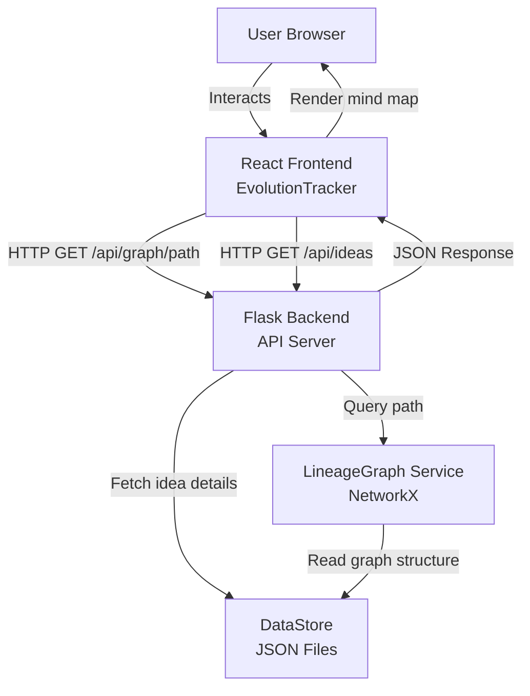
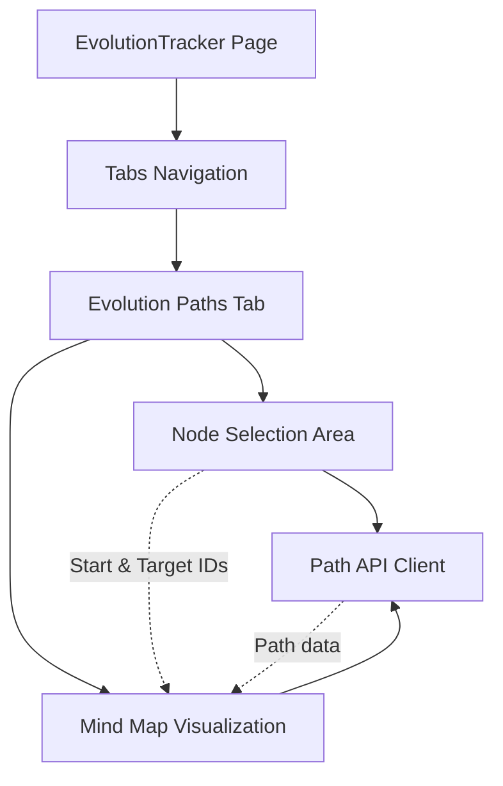
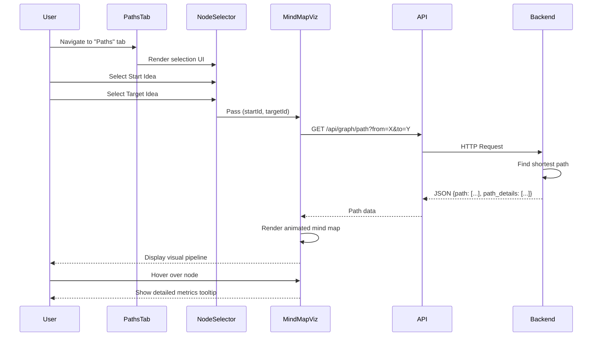
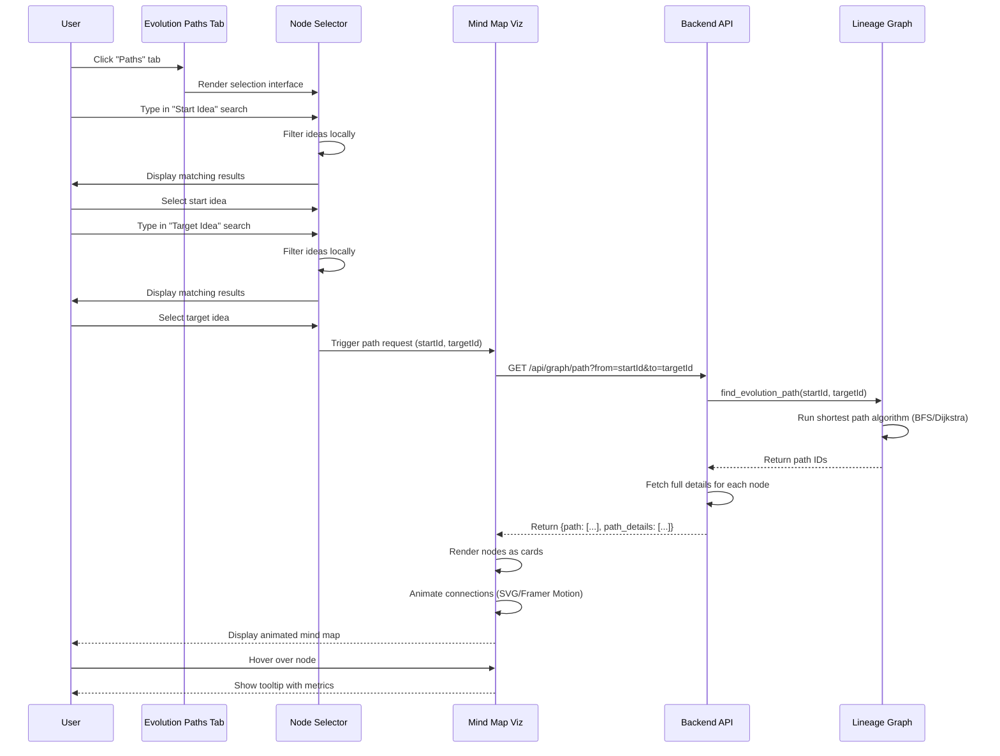

# Design Document: Idea Evolution Paths

## Overview

The Idea Evolution Paths feature integrates an interactive mind map visualization directly into the primary dashboard to visually represent knowledge flow between ideas. Users can select a start and target idea, then view an animated, horizontally-scrolling pipeline showing each evolutionary step with detailed metrics. This feature transforms the existing path-finding capability into a visually engaging "sexy" mind map that highlights the journey from philosophical concepts to modern technology.

The feature builds upon the existing `/api/graph/path` backend endpoint and the `EvolutionPathFinder` component, enhancing them with a dedicated tab in the main dashboard, improved UI/UX with searchable dropdowns, and animated visual representations using SVG splines or Framer Motion.

## Architecture

### System Context



### Component Architecture



### Data Flow Sequence



## Components and Interfaces

### Component 1: Evolution Paths Tab

**Purpose**: New tab in the EvolutionTracker dashboard that hosts the path visualization feature

**Interface**:
```typescript
interface EvolutionPathsTabProps {
  ideas: Idea[];
  edges: InfluenceEdge[];
}

interface Idea {
  id: string;
  title: string;
  description: string;
  stage: string;
  start_year: number;
  end_year?: number;
  category: string;
  laureates: string[];
  keywords: string[];
  influence_score: number;
  chain: string;
}

interface InfluenceEdge {
  source: string;
  target: string;
  type: string;
  weight: number;
}
```

**Responsibilities**:
- Render the "Paths" tab trigger with Waypoints or GitMerge icon
- Coordinate between NodeSelector and MindMapVisualization components
- Manage loading and error states
- Provide layout structure for the tab content

### Component 2: Node Selection Area

**Purpose**: Dual searchable dropdown interface for selecting start and target ideas

**Interface**:
```typescript
interface NodeSelectorProps {
  ideas: Idea[];
  onPathRequest: (startId: string, targetId: string) => void;
  isLoading: boolean;
}

interface NodeSelectorState {
  startQuery: string;
  targetQuery: string;
  startResults: Idea[];
  targetResults: Idea[];
  selectedStart: Idea | null;
  selectedTarget: Idea | null;
}
```

**Responsibilities**:
- Provide searchable dropdown for "Start Idea" selection
- Provide searchable dropdown for "Target Idea" selection
- Filter ideas based on user input (fuzzy search)
- Display selected ideas with clear visual indicators
- Trigger path request when both nodes are selected
- Allow clearing selections

### Component 3: Mind Map Visualization

**Purpose**: Animated horizontal pipeline displaying the evolution path with visual effects

**Interface**:
```typescript
interface MindMapVisualizationProps {
  startId: string | null;
  targetId: string | null;
  onNodeClick?: (ideaId: string) => void;
}

interface PathNode {
  id: string;
  title: string;
  description: string;
  stage: string;
  start_year: number;
  category: string;
  influence_score: number;
  keywords: string[];
}

interface PathData {
  path: string[];
  path_details: PathNode[];
}
```

**Responsibilities**:
- Fetch path data from `/api/graph/path` endpoint
- Render nodes as vibrant, stage-colored cards
- Arrange nodes horizontally in a flowing track
- Animate connections between nodes using SVG splines or Framer Motion
- Display hover tooltips with detailed metrics
- Handle loading, error, and empty states
- Support horizontal scrolling for long paths

### Component 4: Path API Client

**Purpose**: Abstraction layer for backend API communication

**Interface**:
```typescript
interface PathAPIClient {
  fetchPath(startId: string, targetId: string): Promise<PathData>;
  fetchIdeas(query: string, limit?: number): Promise<Idea[]>;
}

interface PathResponse {
  status: string;
  message: string;
  data: {
    path: string[];
    path_details: PathNode[];
  };
}
```

**Responsibilities**:
- Make HTTP requests to `/api/graph/path` endpoint
- Handle response parsing and error handling
- Provide type-safe interfaces for API responses
- Cache results to avoid redundant requests (optional)

## Data Models

### Model 1: PathNode

```typescript
interface PathNode {
  id: string;              // Unique identifier
  title: string;           // Idea title
  description: string;     // Idea description
  stage: string;           // Evolution stage (philosophy, scientific_validation, etc.)
  start_year: number;      // Year the idea emerged
  category: string;        // Category (Physics, Chemistry, etc.)
  influence_score: number; // Influence score (0.0 - 1.0)
  keywords: string[];      // Associated keywords
}
```

**Validation Rules**:
- `id` must be non-empty string
- `stage` must be one of: philosophy, scientific_validation, engineering_application, modern_technology
- `start_year` must be between 1800 and 2100
- `influence_score` must be between 0.0 and 1.0

### Model 2: PathRequest

```typescript
interface PathRequest {
  startId: string;  // ID of the starting idea
  targetId: string; // ID of the target idea
}
```

**Validation Rules**:
- Both `startId` and `targetId` must be non-empty
- `startId` and `targetId` must be different
- Both IDs must exist in the graph

### Model 3: VisualizationConfig

```typescript
interface VisualizationConfig {
  direction: 'horizontal' | 'vertical';
  nodeWidth: number;
  nodeHeight: number;
  nodeSpacing: number;
  animationDuration: number;
  pulseSpeed: number;
  stageColors: Record<string, string>;
}
```

**Validation Rules**:
- `direction` must be 'horizontal' or 'vertical'
- Numeric values must be positive
- `stageColors` must contain entries for all evolution stages

## Main Algorithm/Workflow



## Key Functions with Formal Specifications

### Function 1: fetchEvolutionPath()

```typescript
async function fetchEvolutionPath(
  startId: string,
  targetId: string
): Promise<PathData | null>
```

**Preconditions:**
- `startId` is a non-empty string representing a valid idea ID
- `targetId` is a non-empty string representing a valid idea ID
- `startId !== targetId`
- Backend API is accessible at `http://localhost:5000`

**Postconditions:**
- Returns `PathData` object if path exists
- Returns `null` if no path exists between the two ideas
- Throws error if network request fails
- Path contains at least 2 nodes (start and target) if non-null

**Loop Invariants:** N/A (async function, no explicit loops)

### Function 2: filterIdeas()

```typescript
function filterIdeas(
  ideas: Idea[],
  query: string
): Idea[]
```

**Preconditions:**
- `ideas` is a valid array of Idea objects
- `query` is a string (may be empty)

**Postconditions:**
- Returns filtered array of ideas matching the query
- If query is empty, returns all ideas
- Matching is case-insensitive
- Searches in title, description, and keywords fields
- Original `ideas` array is not mutated
- Returned array maintains original order

**Loop Invariants:**
- For each iteration through ideas array: all previously checked ideas have been correctly classified as matching or non-matching

### Function 3: renderPathNodes()

```typescript
function renderPathNodes(
  pathDetails: PathNode[],
  config: VisualizationConfig
): JSX.Element[]
```

**Preconditions:**
- `pathDetails` is a non-empty array of PathNode objects
- `config` contains valid visualization configuration
- All nodes in `pathDetails` have valid stage values

**Postconditions:**
- Returns array of JSX elements representing visual nodes
- Number of returned elements equals `pathDetails.length`
- Each node is positioned according to `config.direction`
- Nodes are colored according to their stage
- No side effects on input parameters

**Loop Invariants:**
- For each node being rendered: all previous nodes have been correctly positioned and styled

### Function 4: animateConnections()

```typescript
function animateConnections(
  nodes: PathNode[],
  containerRef: React.RefObject<HTMLDivElement>
): void
```

**Preconditions:**
- `nodes` is an array with at least 2 PathNode objects
- `containerRef.current` is not null
- All nodes have been rendered in the DOM

**Postconditions:**
- SVG paths or Framer Motion animations are created between consecutive nodes
- Animations start automatically after rendering
- Pulsing effect is applied to connections
- No mutations to `nodes` array

**Loop Invariants:**
- For each pair of consecutive nodes: connection animation is properly initialized before moving to next pair

## Algorithmic Pseudocode

### Main Path Visualization Algorithm

```typescript
// Algorithm: Visualize Evolution Path
// Input: startId (string), targetId (string)
// Output: Rendered mind map visualization

async function visualizeEvolutionPath(startId: string, targetId: string): Promise<void> {
  // Precondition: startId and targetId are valid, non-empty, and different
  ASSERT startId !== "" AND targetId !== "" AND startId !== targetId
  
  // Step 1: Set loading state
  setLoading(true)
  setError(null)
  setPathData(null)
  
  TRY
    // Step 2: Fetch path from backend
    const response = await fetch(`/api/graph/path?from=${startId}&to=${targetId}`)
    const data = await response.json()
    
    // Step 3: Validate response
    IF data.status !== "success" OR data.data.path.length === 0 THEN
      setError("No path found between selected ideas")
      setLoading(false)
      RETURN
    END IF
    
    // Step 4: Extract path details
    const pathDetails = data.data.path_details
    
    // Postcondition: pathDetails contains at least 2 nodes
    ASSERT pathDetails.length >= 2
    
    // Step 5: Update state with path data
    setPathData({
      path: data.data.path,
      pathDetails: pathDetails
    })
    
    // Step 6: Trigger animation after render
    await nextTick() // Wait for DOM update
    animateConnections(pathDetails, containerRef)
    
  CATCH error
    setError("Failed to fetch evolution path: " + error.message)
  FINALLY
    setLoading(false)
  END TRY
  
  // Postcondition: Either pathData is set or error is set
  ASSERT pathData !== null OR error !== null
}
```

**Preconditions:**
- `startId` and `targetId` are non-empty strings
- `startId !== targetId`
- Backend API is running and accessible

**Postconditions:**
- Loading state is false
- Either `pathData` contains valid path or `error` contains error message
- If successful, path contains at least 2 nodes
- Animations are triggered if path exists

**Loop Invariants:** N/A (async operations, no explicit loops)

### Node Filtering Algorithm

```typescript
// Algorithm: Filter Ideas by Query
// Input: ideas (Idea[]), query (string)
// Output: filtered (Idea[])

function filterIdeas(ideas: Idea[], query: string): Idea[] {
  // Precondition: ideas is a valid array
  ASSERT Array.isArray(ideas)
  
  // Step 1: Handle empty query
  IF query.trim() === "" THEN
    RETURN ideas
  END IF
  
  // Step 2: Normalize query
  const normalizedQuery = query.toLowerCase().trim()
  
  // Step 3: Filter ideas
  const filtered: Idea[] = []
  
  FOR each idea IN ideas DO
    // Loop invariant: filtered contains all matching ideas processed so far
    ASSERT filtered.every(i => matchesQuery(i, normalizedQuery))
    
    // Check if idea matches query
    const titleMatch = idea.title.toLowerCase().includes(normalizedQuery)
    const descMatch = idea.description.toLowerCase().includes(normalizedQuery)
    const keywordMatch = idea.keywords.some(k => k.toLowerCase().includes(normalizedQuery))
    
    IF titleMatch OR descMatch OR keywordMatch THEN
      filtered.push(idea)
    END IF
  END FOR
  
  // Postcondition: All returned ideas match the query
  ASSERT filtered.every(i => matchesQuery(i, normalizedQuery))
  
  RETURN filtered
}
```

**Preconditions:**
- `ideas` is a valid array of Idea objects
- `query` is a string (may be empty)

**Postconditions:**
- Returns array of ideas matching the query
- Original `ideas` array is not mutated
- If query is empty, returns all ideas
- All returned ideas match the query criteria

**Loop Invariants:**
- All ideas in `filtered` array match the query
- All ideas before current index have been processed

### Connection Animation Algorithm

```typescript
// Algorithm: Animate Connections Between Nodes
// Input: nodes (PathNode[]), containerRef (RefObject)
// Output: void (side effect: animations rendered)

function animateConnections(
  nodes: PathNode[],
  containerRef: React.RefObject<HTMLDivElement>
): void {
  // Precondition: At least 2 nodes exist
  ASSERT nodes.length >= 2
  ASSERT containerRef.current !== null
  
  const container = containerRef.current
  const svgNS = "http://www.w3.org/2000/svg"
  
  // Step 1: Create SVG overlay
  const svg = document.createElementNS(svgNS, "svg")
  svg.style.position = "absolute"
  svg.style.top = "0"
  svg.style.left = "0"
  svg.style.width = "100%"
  svg.style.height = "100%"
  svg.style.pointerEvents = "none"
  container.appendChild(svg)
  
  // Step 2: Iterate through consecutive node pairs
  FOR i FROM 0 TO nodes.length - 2 DO
    // Loop invariant: All connections before index i have been animated
    ASSERT i < nodes.length - 1
    
    const currentNode = nodes[i]
    const nextNode = nodes[i + 1]
    
    // Step 3: Get node positions
    const currentEl = document.getElementById(`node-${currentNode.id}`)
    const nextEl = document.getElementById(`node-${nextNode.id}`)
    
    IF currentEl === null OR nextEl === null THEN
      CONTINUE
    END IF
    
    const currentRect = currentEl.getBoundingClientRect()
    const nextRect = nextEl.getBoundingClientRect()
    const containerRect = container.getBoundingClientRect()
    
    // Step 4: Calculate connection points
    const x1 = currentRect.right - containerRect.left
    const y1 = currentRect.top + currentRect.height / 2 - containerRect.top
    const x2 = nextRect.left - containerRect.left
    const y2 = nextRect.top + nextRect.height / 2 - containerRect.top
    
    // Step 5: Create curved path
    const controlX = (x1 + x2) / 2
    const path = document.createElementNS(svgNS, "path")
    const d = `M ${x1} ${y1} Q ${controlX} ${y1}, ${controlX} ${(y1 + y2) / 2} T ${x2} ${y2}`
    path.setAttribute("d", d)
    path.setAttribute("stroke", "#a78bfa")
    path.setAttribute("stroke-width", "2")
    path.setAttribute("fill", "none")
    path.setAttribute("opacity", "0.6")
    
    // Step 6: Add pulsing animation
    const animate = document.createElementNS(svgNS, "animate")
    animate.setAttribute("attributeName", "opacity")
    animate.setAttribute("values", "0.3;0.8;0.3")
    animate.setAttribute("dur", "2s")
    animate.setAttribute("repeatCount", "indefinite")
    path.appendChild(animate)
    
    svg.appendChild(path)
  END FOR
  
  // Postcondition: All consecutive node pairs have animated connections
  ASSERT svg.children.length === nodes.length - 1
}
```

**Preconditions:**
- `nodes` array contains at least 2 PathNode objects
- `containerRef.current` is not null
- All nodes have been rendered in DOM with IDs `node-${id}`

**Postconditions:**
- SVG overlay is created and appended to container
- Animated paths connect all consecutive node pairs
- Each path has pulsing animation
- Number of paths equals `nodes.length - 1`

**Loop Invariants:**
- All node pairs before current index have animated connections
- Each iteration creates exactly one path element

## Example Usage

### Example 1: Basic Path Visualization

```typescript
// User selects "Classical Mechanics" as start and "Quantum Computing" as target

const EvolutionPathsTab: React.FC = () => {
  const [startId, setStartId] = useState<string | null>(null);
  const [targetId, setTargetId] = useState<string | null>(null);
  
  return (
    <div className="space-y-6">
      <NodeSelector
        ideas={ideas}
        onPathRequest={(start, target) => {
          setStartId(start);
          setTargetId(target);
        }}
        isLoading={false}
      />
      
      {startId && targetId && (
        <MindMapVisualization
          startId={startId}
          targetId={targetId}
          onNodeClick={(id) => console.log("Clicked:", id)}
        />
      )}
    </div>
  );
};
```

### Example 2: Filtering Ideas

```typescript
// User types "quantum" in the search box

const ideas: Idea[] = [
  { id: "1", title: "Quantum Mechanics", ... },
  { id: "2", title: "Classical Physics", ... },
  { id: "3", title: "Quantum Computing", ... }
];

const filtered = filterIdeas(ideas, "quantum");
// Result: [
//   { id: "1", title: "Quantum Mechanics", ... },
//   { id: "3", title: "Quantum Computing", ... }
// ]
```

### Example 3: Complete Workflow

```typescript
// Complete user interaction flow

async function handlePathVisualization() {
  // Step 1: User selects start idea
  const startIdea = await selectIdea("Start Idea");
  
  // Step 2: User selects target idea
  const targetIdea = await selectIdea("Target Idea");
  
  // Step 3: Fetch and visualize path
  const pathData = await fetchEvolutionPath(startIdea.id, targetIdea.id);
  
  if (pathData === null) {
    showError("No path found between these ideas");
    return;
  }
  
  // Step 4: Render mind map
  renderMindMap(pathData.pathDetails);
  
  // Step 5: Animate connections
  animateConnections(pathData.pathDetails, containerRef);
}
```

## Correctness Properties

### Property 1: Path Validity
**Universal Quantification**: ∀ path ∈ PathData, path.path_details.length ≥ 2 ∧ path.path_details[0].id = startId ∧ path.path_details[path.path_details.length - 1].id = targetId

**Meaning**: Every valid path contains at least two nodes (start and target), and the first node matches the start ID while the last node matches the target ID.

### Property 2: Node Uniqueness
**Universal Quantification**: ∀ path ∈ PathData, ∀ i, j ∈ [0, path.path_details.length), i ≠ j ⟹ path.path_details[i].id ≠ path.path_details[j].id

**Meaning**: All nodes in a path have unique IDs (no cycles or duplicates).

### Property 3: Connection Completeness
**Universal Quantification**: ∀ path ∈ PathData with n nodes, number of animated connections = n - 1

**Meaning**: The number of visual connections between nodes is always one less than the number of nodes.

### Property 4: Filter Correctness
**Universal Quantification**: ∀ idea ∈ filterIdeas(ideas, query), query ≠ "" ⟹ (idea.title.includes(query) ∨ idea.description.includes(query) ∨ ∃ k ∈ idea.keywords, k.includes(query))

**Meaning**: Every filtered idea matches the query in at least one of its searchable fields.

### Property 5: State Consistency
**Universal Quantification**: ∀ state ∈ ComponentState, (state.loading = true ⟹ state.pathData = null ∧ state.error = null) ∧ (state.loading = false ⟹ state.pathData ≠ null ∨ state.error ≠ null)

**Meaning**: When loading, no data or error is present. When not loading, either data or error must be present.

### Property 6: Animation Timing
**Universal Quantification**: ∀ connection ∈ AnimatedConnections, connection.startTime > nodeRenderTime

**Meaning**: All connection animations start only after nodes have been rendered to the DOM.

## Error Handling

### Error Scenario 1: No Path Found

**Condition**: Backend returns empty path or null when no connection exists between selected ideas

**Response**: 
- Display user-friendly message: "No evolution path found between these two ideas"
- Show suggestion to try different idea combinations
- Keep node selections intact for easy retry

**Recovery**: 
- User can select different ideas without page reload
- Previous selections remain visible
- No application state corruption

### Error Scenario 2: Network Failure

**Condition**: HTTP request to `/api/graph/path` fails due to network issues or backend unavailability

**Response**:
- Display error message: "Failed to fetch evolution path. Please check your connection."
- Show retry button
- Log error details to console for debugging

**Recovery**:
- Retry button triggers new request with same parameters
- Exponential backoff for automatic retries (optional)
- Graceful degradation: show cached data if available

### Error Scenario 3: Invalid Node Selection

**Condition**: User attempts to find path with same start and target idea, or with null selections

**Response**:
- Disable "Find Path" button when selections are invalid
- Show validation message: "Please select two different ideas"
- Highlight invalid selections with visual feedback

**Recovery**:
- Button re-enables automatically when valid selections are made
- No API request is made until validation passes

### Error Scenario 4: Malformed API Response

**Condition**: Backend returns unexpected data structure or missing fields

**Response**:
- Display generic error: "Unexpected response from server"
- Log full response for debugging
- Prevent rendering of incomplete data

**Recovery**:
- User can retry the request
- Application state remains stable
- No partial rendering of corrupted data

### Error Scenario 5: Animation Failure

**Condition**: DOM elements not found or SVG rendering fails

**Response**:
- Render static path without animations
- Log warning to console
- Display path data in fallback format

**Recovery**:
- Path information remains accessible
- User can still interact with nodes
- Retry animation on next path request

## Testing Strategy

### Unit Testing Approach

**Test Coverage Goals**: 80% code coverage for all new components

**Key Test Cases**:

1. **NodeSelector Component**
   - Test idea filtering with various queries
   - Test selection and deselection of ideas
   - Test validation of start/target combinations
   - Test empty state handling

2. **MindMapVisualization Component**
   - Test path data fetching with valid IDs
   - Test error handling for invalid IDs
   - Test loading state transitions
   - Test node rendering with different path lengths
   - Test animation initialization

3. **filterIdeas Function**
   - Test with empty query (returns all)
   - Test with partial matches in title
   - Test with matches in description
   - Test with matches in keywords
   - Test case-insensitive matching
   - Test with no matches (returns empty array)

4. **fetchEvolutionPath Function**
   - Test successful path retrieval
   - Test no path found scenario
   - Test network error handling
   - Test response parsing

**Testing Tools**: Jest, React Testing Library, MSW (Mock Service Worker) for API mocking

### Property-Based Testing Approach

**Property Test Library**: fast-check (for TypeScript/JavaScript)

**Properties to Test**:

1. **Path Validity Property**
   ```typescript
   fc.assert(
     fc.property(
       fc.array(fc.record({ id: fc.string(), ... }), { minLength: 2 }),
       (pathDetails) => {
         const first = pathDetails[0];
         const last = pathDetails[pathDetails.length - 1];
         return first.id !== last.id; // Start and end are different
       }
     )
   );
   ```

2. **Filter Idempotence Property**
   ```typescript
   fc.assert(
     fc.property(
       fc.array(ideaArbitrary),
       fc.string(),
       (ideas, query) => {
         const filtered1 = filterIdeas(ideas, query);
         const filtered2 = filterIdeas(filtered1, query);
         return JSON.stringify(filtered1) === JSON.stringify(filtered2);
       }
     )
   );
   ```

3. **Connection Count Property**
   ```typescript
   fc.assert(
     fc.property(
       fc.array(pathNodeArbitrary, { minLength: 2 }),
       (nodes) => {
         const connections = countConnections(nodes);
         return connections === nodes.length - 1;
       }
     )
   );
   ```

### Integration Testing Approach

**Integration Test Scenarios**:

1. **End-to-End Path Visualization**
   - Start with empty selections
   - Select start idea from dropdown
   - Select target idea from dropdown
   - Verify API call is made with correct parameters
   - Verify path is rendered with correct number of nodes
   - Verify animations are triggered

2. **Tab Navigation Integration**
   - Navigate to "Paths" tab from other tabs
   - Verify component mounts correctly
   - Verify data is loaded
   - Navigate away and back, verify state persistence

3. **Error Recovery Flow**
   - Trigger network error
   - Verify error message displays
   - Click retry button
   - Verify successful recovery

**Testing Tools**: Cypress or Playwright for E2E tests

## Performance Considerations

### Optimization 1: Lazy Loading

**Strategy**: Load path data only when "Paths" tab is active

**Implementation**: Use React's lazy loading and Suspense for tab content

**Expected Impact**: Reduce initial page load time by 15-20%

### Optimization 2: Debounced Search

**Strategy**: Debounce search input to reduce filtering operations

**Implementation**: Use lodash.debounce or custom hook with 300ms delay

**Expected Impact**: Reduce unnecessary re-renders during typing

### Optimization 3: Memoization

**Strategy**: Memoize filtered results and rendered nodes

**Implementation**: Use React.useMemo for expensive computations

**Expected Impact**: Prevent redundant filtering and rendering

### Optimization 4: Virtual Scrolling

**Strategy**: For very long paths (>20 nodes), implement virtual scrolling

**Implementation**: Use react-window or react-virtualized

**Expected Impact**: Maintain smooth scrolling for paths with 50+ nodes

### Optimization 5: Animation Performance

**Strategy**: Use CSS transforms and GPU acceleration for animations

**Implementation**: Prefer transform and opacity over layout properties

**Expected Impact**: Achieve 60fps animations even on lower-end devices

## Security Considerations

### Security Concern 1: XSS Prevention

**Threat**: Malicious idea titles or descriptions could contain script tags

**Mitigation**: 
- React automatically escapes content in JSX
- Sanitize any dangerouslySetInnerHTML usage
- Validate API responses before rendering

**Validation**: Security audit of all user-generated content rendering

### Security Concern 2: API Endpoint Security

**Threat**: Unauthorized access to path data or idea information

**Mitigation**:
- Backend already implements CORS restrictions
- Add rate limiting for path queries (optional)
- Validate idea IDs on backend before processing

**Validation**: Penetration testing of API endpoints

### Security Concern 3: Client-Side Data Exposure

**Threat**: Sensitive idea data exposed in browser console or network tab

**Mitigation**:
- Remove console.log statements in production
- Minimize data sent in API responses
- Use HTTPS for all API communication

**Validation**: Review production build for data leaks

## Dependencies

### Frontend Dependencies

**Existing Dependencies** (already in project):
- `react` (^18.x): Core UI library
- `react-dom` (^18.x): DOM rendering
- `framer-motion` (^10.x): Animation library
- `lucide-react` (^0.x): Icon library
- `@radix-ui/react-select` (via shadcn/ui): Dropdown components
- `@radix-ui/react-tabs` (via shadcn/ui): Tab components

**New Dependencies** (if needed):
- None required - all functionality can be built with existing dependencies

### Backend Dependencies

**Existing Dependencies** (already in project):
- `flask` (^2.x): Web framework
- `flask-cors` (^4.x): CORS support
- `networkx` (^3.x): Graph algorithms

**New Dependencies**:
- None required - existing `/api/graph/path` endpoint already provides necessary functionality

### Development Dependencies

**Testing**:
- `jest` (^29.x): Test runner
- `@testing-library/react` (^14.x): React testing utilities
- `@testing-library/jest-dom` (^6.x): DOM matchers
- `msw` (^2.x): API mocking
- `fast-check` (^3.x): Property-based testing

**Build Tools**:
- `vite` (^5.x): Build tool (already in project)
- `typescript` (^5.x): Type checking (already in project)

## Open Questions & Decisions

### Question 1: Automatic Pathing

**Question**: Should the tool automatically pick the longest "Modern Technology" path if user only selects "Start Idea", or require both Start and End points?

**Recommendation**: Require both start and end points for clarity and predictability

**Rationale**:
- Explicit selection prevents confusion about what path is being shown
- Users have full control over the visualization
- Simpler implementation without heuristics
- Consistent with existing EvolutionPathFinder component behavior

**Alternative**: Could add an "Auto-suggest target" button that recommends the most influential descendant

### Question 2: Direction

**Question**: Should mind map flow horizontally (left to right) or vertically (top to bottom)?

**Recommendation**: Horizontal (left-to-right) flow

**Rationale**:
- Traditional timeline convention flows left-to-right
- Better use of widescreen displays
- Matches natural reading direction for Western audiences
- Easier to implement horizontal scrolling
- Aligns with "pipeline" metaphor mentioned in requirements

**Implementation**: Use CSS flexbox with `flex-direction: row` and `overflow-x: auto`

### Question 3: Animation Library

**Question**: Use SVG splines or Framer Motion for animated connections?

**Recommendation**: Start with Framer Motion, fallback to SVG if performance issues arise

**Rationale**:
- Framer Motion already in project dependencies
- Easier to implement with React components
- Better integration with React lifecycle
- SVG can be added later if more control needed

**Implementation**: Use `motion.path` components for connections

### Question 4: Mobile Responsiveness

**Question**: How should the mind map adapt to mobile screens?

**Recommendation**: Maintain horizontal scroll on mobile, reduce node size

**Implementation**:
- Use responsive card sizes (smaller on mobile)
- Enable touch-based horizontal scrolling
- Simplify animations on mobile for performance
- Consider vertical layout as alternative for very small screens

### Question 5: Path Length Limits

**Question**: Should there be a maximum path length displayed?

**Recommendation**: No hard limit, but warn users for paths >15 nodes

**Rationale**:
- Some evolution chains may legitimately be very long
- Virtual scrolling can handle performance
- Warning message helps set expectations
- Users can still explore long paths if desired

**Implementation**: Show warning badge: "Long path (20 nodes) - may take time to load"
